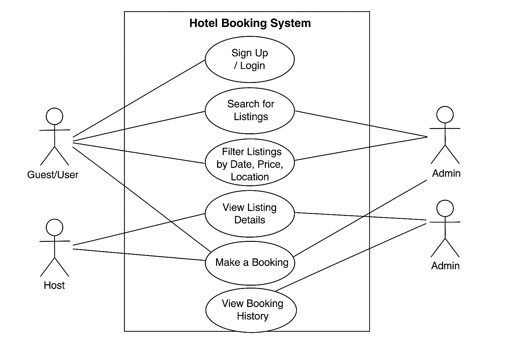

# Requirement Analysis in Software Development

## 📌 Introduction

Welcome to the **Requirement Analysis in Software Development** repository.

This repository is created to provide a clear understanding of the **requirement analysis** phase in the software development lifecycle. It includes guidelines, templates, case studies, and best practices that help stakeholders—such as developers, analysts, and project managers—identify and document what a software system should accomplish.

Requirement analysis is a critical first step in building successful software, and this repository aims to serve as a practical guide for conducting thorough and effective analysis to ensure that software products meet real user and business needs.

---

## ❓ What is Requirement Analysis?

**Requirement Analysis** is the process of identifying, gathering, documenting, and validating the needs and expectations of stakeholders for a new or modified software system. It involves a detailed study of what the system should do, how it should behave, and the constraints under which it must operate.

This process is usually carried out in collaboration with stakeholders such as end-users, clients, project managers, and developers to ensure that all functional and non-functional requirements are clearly understood and agreed upon before development begins.

### 🔍 Key Activities in Requirement Analysis

- **Elicitation**: Gathering requirements from stakeholders using interviews, questionnaires, observation, and workshops.
- **Analysis**: Structuring and prioritizing the collected requirements to identify conflicts, overlaps, and gaps.
- **Specification**: Documenting the requirements in a clear, complete, and unambiguous format (e.g., SRS - Software Requirements Specification).
- **Validation**: Reviewing the documented requirements with stakeholders to confirm accuracy and completeness.
- **Management**: Keeping track of changes to requirements throughout the project lifecycle.

### 🚀 Importance of Requirement Analysis in the SDLC

Requirement Analysis is a foundational phase in the Software Development Lifecycle (SDLC) and plays a crucial role in the success of any software project. Here’s why it’s important:

- **Clarity of Goals**: Helps all stakeholders have a shared understanding of what the software must achieve.
- **Risk Reduction**: Identifies potential problems early, reducing the chances of costly rework later.
- **Scope Definition**: Clearly defines the scope of the project, preventing scope creep and missed deadlines.
- **Improved Quality**: Leads to software that better meets user needs and expectations.
- **Efficient Resource Use**: Saves time and effort by guiding developers with well-defined and validated requirements.

---

## ✅ Why is Requirement Analysis Important?

Requirement Analysis is one of the most critical phases in the Software Development Lifecycle (SDLC). Without it, projects are vulnerable to unclear goals, frequent changes, and costly errors. Here are three key reasons why this phase is essential:

### 1. 🔎 Ensures Clear Understanding of Project Scope

Requirement analysis helps all stakeholders—including clients, users, and developers—achieve a shared understanding of what the software should do. This clarity minimizes ambiguity, reduces miscommunication, and sets accurate expectations early in the project.

### 2. 💸 Reduces Development Costs and Rework

By identifying and addressing issues early in the lifecycle, requirement analysis prevents expensive changes later during development or after deployment. A well-defined set of requirements reduces the need for rework, saving both time and money.

### 3. 📈 Enhances Product Quality and User Satisfaction

When software is built based on validated and complete requirements, the final product is more likely to meet user needs. This leads to improved usability, higher customer satisfaction, and fewer post-release issues.

---

## 🧩 Key Activities in Requirement Analysis

Requirement Analysis involves several structured activities that ensure the final software product meets stakeholder expectations. Below are the five key activities in this process:

- **📝 Requirement Gathering**  
  Collecting initial information from stakeholders about their needs, problems, and expectations. This often includes meetings, interviews, questionnaires, and reviewing existing systems or documentation.

- **🗣️ Requirement Elicitation**  
  Actively engaging with stakeholders to uncover hidden, implied, or unspoken needs. This goes beyond simple data collection and involves techniques such as brainstorming, user observation, use cases, and prototyping.

- **📄 Requirement Documentation**  
  Clearly documenting all gathered and elicited requirements in a structured format. This typically results in formal documents like the Software Requirements Specification (SRS), which serve as a reference for all development phases.

- **📊 Requirement Analysis and Modeling**  
  Examining and organizing requirements to identify gaps, conflicts, redundancies, or inconsistencies. It also includes modeling techniques like flowcharts, UML diagrams, or user stories to visualize and better understand requirements.

- **✅ Requirement Validation**  
  Verifying that all documented requirements accurately reflect stakeholder needs and expectations. This includes reviews, walkthroughs, and formal approval sessions to confirm completeness and correctness before moving into design and development.

---

## 🧱 Types of Requirements

In software development, requirements are generally categorized into two main types: **Functional Requirements** and **Non-functional Requirements**. Understanding both is essential for building a system that not only works but performs effectively.

### 🔧 Functional Requirements

Functional requirements describe **what the system should do**—the features, behaviors, and functions of the application.

For a **hotel booking management project** (e.g., Airbnb, OYO), examples include:

- **User Authentication**: Users should be able to sign up, log in, and manage their profiles.
- **Search & Filter Listings**: Users should be able to search for accommodations by city, date, price, and amenities.
- **Booking System**: Users can select a listing, view availability, and make a booking.
- **Payment Integration**: Users can securely make payments using different methods like credit card, PayPal, or wallet.
- **Booking History**: Users can view and manage their past and upcoming reservations.
- **Host Management**: Hosts can list new properties, update information, and manage bookings.
- **Admin Dashboard**: Admins can monitor platform activity, user reports, and resolve disputes.

These requirements define **how the system behaves** in response to user interactions and are core to the app's business logic.

### ⚙️ Non-functional Requirements

Non-functional requirements define **how the system should perform**. These include performance, usability, scalability, and security aspects.

For the same hotel booking platform, examples include:

- **Performance**: The system should handle at least 10,000 concurrent user sessions without significant lag.
- **Scalability**: The architecture must support horizontal scaling to accommodate growth in listings and user base.
- **Security**: Sensitive data (e.g., passwords, payment info) should be encrypted both at rest and in transit.
- **Availability**: The system should maintain 99.9% uptime to ensure booking reliability.
- **Responsiveness**: The web and mobile interfaces should load within 2 seconds for users on a 4G connection.
- **Data Consistency**: Bookings must be atomic—no two users should be able to book the same room for the same date.
- **Compliance**: The system must comply with data privacy laws like GDPR or local equivalents.

Non-functional requirements ensure the system is **reliable, secure, and user-friendly**, complementing the core functionality.

---

## 🧩 Use Case Diagrams

**Use Case Diagrams** are a type of behavioral diagram in UML (Unified Modeling Language) that visually represent the interactions between users (actors) and the system to achieve specific goals (use cases). They help in understanding **who** will interact with the system and **what** functionalities the system should offer.

### 📈 Benefits of Use Case Diagrams

- Provide a **high-level overview** of the system functionality.
- Help identify **all user interactions** with the system early in the development process.
- Serve as a communication tool between **stakeholders and developers**.
- Make it easier to write **detailed requirements** and plan test cases.

### 🖼️ Use Case Diagram: Hotel Booking System

Below is a sample use case diagram representing a simplified booking system for a platform like Airbnb or OYO. The diagram includes key actors and their associated use cases.

### 👤 Actors

- **Guest/User**: A person who searches and books listings.
- **Host**: A person who lists and manages properties.
- **Admin**: Oversees the platform, manages users, and handles complaints.

### 🔄 Use Cases

- **Sign Up / Login**
- **Search for Listings**
- **Filter Listings by Date, Price, Location**
- **View Listing Details**
- **Make a Booking**
- **Make Payment**
- **View Booking History**
- **List a Property** (Host)
- **Manage Bookings** (Host)
- **Resolve Disputes** (Admin)
- **Remove Listing or User** (Admin)

---

## ✅ Acceptance Criteria

### 📌 What is Acceptance Criteria?

**Acceptance Criteria** are the conditions that a software product must satisfy to be accepted by a user, customer, or other stakeholders. They are used to define the boundaries of a user story or feature and guide the development and testing processes.

In Requirement Analysis, acceptance criteria are crucial for:

- Ensuring **clarity** on what a feature must do.
- Aligning **expectations** between stakeholders and developers.
- Serving as a **basis for test cases** and quality assurance.
- Helping determine when a feature is **“done”**.

Clear acceptance criteria reduce ambiguity and miscommunication, and they help teams deliver functionality that meets user needs.

---

### 🧾 Example: Acceptance Criteria for Checkout Feature

**Feature:** Checkout Process for Hotel Booking

**Acceptance Criteria:**

- ✅ The user must be able to review booking details (hotel name, price, dates, number of guests) before confirming.
- ✅ The system must display a summary of charges including taxes and fees.
- ✅ The user must be able to enter and validate payment information securely.
- ✅ Payment must be processed using integrated payment gateways (e.g., Stripe, Paystack).
- ✅ The system must show a confirmation message and booking ID after successful payment.
- ✅ A booking confirmation email must be sent to the user within 1 minute of successful checkout.
- ✅ If payment fails, the user must be notified with an appropriate error message and retry options.
